# PropSense AI 🏠🤖

> **Intelligent Predictive Maintenance for Social Housing**

A commercial-grade Digital Twin platform that uses IoT sensor data to predict property failures (damp, boiler breakdowns) before they happen.

## 🏗️ Architecture

```mermaid
graph TD
    %% Define styles
    classDef client fill:#0078D4,stroke:#005A9E,stroke-width:2px,color:#FFF,rx:8px,ry:8px
    classDef backend fill:#E3008C,stroke:#A1006B,stroke-width:2px,color:#FFF,rx:8px,ry:8px
    classDef db fill:#008A00,stroke:#006600,stroke-width:2px,color:#FFF,rx:8px,ry:8px
    classDef iot fill:#FF8C00,stroke:#E67300,stroke-width:2px,color:#FFF,rx:8px,ry:8px
    classDef cloud fill:#2B88D8,stroke:#005A9E,stroke-width:2px,color:#FFF,rx:8px,ry:8px,stroke-dasharray: 5 5

    %% Nodes
    subgraph Clients ["Users Frontends"]
        Mobile["📱 Tenant App<br>(React Native / Expo)"]:::client
        Web["💻 Landlord Dashboard<br>(React / Vite)"]:::client
    end

    subgraph Devices ["Edge IoT Devices"]
        Sensor["🌡️ IoT Simulator<br>(Python script)"]:::iot
    end

    subgraph CoreServices ["Core Services"]
        API["⚙️ Backend API & Risk Engine<br>(Python FastAPI)"]:::backend
    end

    subgraph DataLayer ["Data Persistence"]
        SQLite[("🗄️ SQLite<br>(Local DB)")]:::db
        AzureSQL[("☁️ Azure SQL<br>(Production DB)")]:::cloud
    end

    subgraph CloudMessaging ["Cloud Event Broker (Future)"]
        IoTHub("☁️ Azure IoT Hub<br>(Telemetry Routing)"):::cloud
    end

    %% Connections
    Mobile -- "REST HTTPS\n(Report Issues)" --> API
    Web -- "REST HTTPS\n(Fetch Data & Analytics)" --> API
    Sensor -- "HTTP POST\n(Synthetic Telemetry)" --> API
    
    API -- "SQLAlchemy ORM\n(Read/Write)" --> SQLite
    API -. "SQLAlchemy ORM\n(Future Production)" .-> AzureSQL
    Sensor -. "MQTT\n(Future Route)" .-> IoTHub
    IoTHub -. "Event Grid / Trigger" .-> API
```



### Components

- **Backend:** Python FastAPI (REST API + Risk Engine).
- **Database:** SQLite (SQLAlchemy) - *Ready for Azure SQL*.
- **IoT Simulator:** Python script generating synthetic telemetry data.
- **Frontend (Web):** React.js + Vite + Tailwind CSS (Landlord Dashboard).
- **Mobile (Tenant):** React Native (Expo) - (Tenant Reporting App).

## � Configuration (Industry Standard)

We use **Environment Variables** to manage secrets (API Keys, Database URLs), keeping them out of the code.

1.  Go to `propsense-ai/backend`.
2.  Rename `.env.example` to `.env`.
3.  Add your keys:

```ini
# Azure IoT Hub Connection String
AZURE_IOT_CONNECTION_STRING=HostName=my-hub.azure-devices.net;DeviceId=...

# Azure SQL Database (Optional - defaults to local SQLite)
# DATABASE_URL=mssql+pyodbc://...
```

## �🚀 How to Run (The "MVP" Demo)

You need **3 Terminal Windows** to run the full stack.

### Terminal 1: Backend (The Core)
```bash
cd propsense-ai/backend
pip install -r requirements.txt
python main.py
```
*API available at: http://localhost:8000*
*Swagger Docs: http://localhost:8000/docs*

### Terminal 2: IoT Simulator (The "House")
```bash
cd propsense-ai/backend
python sim.py
```
*You will see logs like: `Sent: {'temp': 16.5, 'humidity': 82} -> API Status: 200 | Risk: High`*

### Terminal 3: Web Dashboard (Landlord View)
```bash
cd propsense-ai/web
npm install
npm run dev
```
*Open http://localhost:5173 to see the dashboard live-update.*

### Terminal 4 (Optional): Mobile App (Tenant View)
```bash
cd propsense-ai/mobile
npx expo start --web
```
*Press `w` to open in browser.*

---

## 🧠 Architecture Decision Record (ADR)

### Why FastAPI over Flask?
*   **Performance:** FastAPI is built on Starlette and Pydantic, making it significantly faster than Flask.
*   **Validation:** Pydantic provides automatic data validation. If a sensor sends a string usually of a float, the API rejects it automatically (prevents bad data pollution).
*   **Async Native:** Handles IoT concurrency better than synchronous frameworks.
*   **Documentation:** Automatically generates Swagger UI (`/docs`), which is standard in enterprise environments.

### Why React Native (Expo) over Swift/Kotlin?
*   **Cross-Platform:** One codebase for iOS and Android.
*   **Speed:** "Over-the-air" updates and fast refresh improve developer velocity.
*   **Consistency:** Shared logic with the React Web Dashboard.

### Why SQLite (with SQLAlchemy)?
*   **Portability:** Zero-config for local development.
*   **Scalability Path:** Using SQLAlchemy ORM means we can switch to **Azure SQL** just by changing the `DATABASE_URL` environment variable, requires NO code changes.

## 🔮 Future Roadmap
- [ ] **Azure IoT Hub Integration:** Fully move MQTT traffic to the cloud.
- [ ] **Push Notifications:** Alert tenants/landlords via Firebase.
- [ ] **Docker:** Containerize the backend for easier deployment.
