<div align="center">

# 🏠 PropSense AI

**Intelligent Predictive Maintenance for Social Housing**

A Digital Twin platform that uses IoT sensor data and a rule-based risk engine to predict property failures before they happen.


<table>
  <tr>
    <td align="center"><strong>💻 Web Dashboard</strong></td>
    <td align="center"><strong>📱 Mobile App</strong></td>
  </tr>
  <tr>
    <td>
      <!-- Drag your WEB video into a GitHub Issue, copy the URL, paste in src="" -->
      <video src="https://github.com/user-attachments/assets/50a37571-d009-466e-82db-b599cf623230"
        autoplay loop muted playsinline width="100%">
      </video>
    </td>
    <td>
      <!-- Drag your MOBILE video into a GitHub Issue, copy the URL, paste in src="" -->
      <video src="https://github.com/user-attachments/assets/a49570ab-8b98-4669-91be-84a91becc3f2"
        autoplay loop muted playsinline width="100%">
      </video>
    </td>
  </tr>
</table>

</div>


---

## 📖 Overview

PropSense AI is a **3-tier monorepo** combining a FastAPI backend, a React landlord dashboard, a React Native tenant app, and an IoT simulator — all communicating through a central REST API. The risk engine automatically classifies incoming sensor readings as `Low`, `Medium`, or `High` risk using deterministic rules, enabling proactive maintenance before small issues become expensive failures.

---

## 🏗️ Architecture

```mermaid
graph TD
    classDef client fill:#0078D4,stroke:#005A9E,stroke-width:2px,color:#FFF
    classDef backend fill:#E3008C,stroke:#A1006B,stroke-width:2px,color:#FFF
    classDef db fill:#008A00,stroke:#006600,stroke-width:2px,color:#FFF
    classDef iot fill:#FF8C00,stroke:#E67300,stroke-width:2px,color:#FFF
    classDef cloud fill:#2B88D8,stroke:#005A9E,stroke-width:2px,color:#FFF,stroke-dasharray: 5 5

    subgraph Clients ["👥 User Frontends"]
        Mobile["📱 Tenant App\n(React Native / Expo)"]:::client
        Web["💻 Landlord Dashboard\n(React / Vite)"]:::client
    end

    subgraph Devices ["🌡️ Edge IoT Devices"]
        Sensor["IoT Simulator\n(Python script)"]:::iot
    end

    subgraph CoreServices ["⚙️ Core Services"]
        API["Backend API & Risk Engine\n(Python FastAPI)"]:::backend
    end

    subgraph DataLayer ["🗄️ Data Persistence"]
        SQLite[("SQLite\n(Local DB)")]:::db
        AzureSQL[("☁️ Azure SQL\n(Production DB)")]:::cloud
    end

    subgraph CloudMessaging ["☁️ Cloud Event Broker (Future)"]
        IoTHub("Azure IoT Hub\n(Telemetry Routing)"):::cloud
    end

    Mobile -- "REST HTTPS\n(Report Issues)" --> API
    Web -- "REST HTTPS\n(Fetch Data & Analytics)" --> API
    Sensor -- "HTTP POST\n(Synthetic Telemetry)" --> API

    API -- "SQLAlchemy ORM\n(Read/Write)" --> SQLite
    API -. "SQLAlchemy ORM\n(Future Production)" .-> AzureSQL
    Sensor -. "MQTT\n(Future Route)" .-> IoTHub
    IoTHub -. "Event Grid / Trigger" .-> API
```



---

## 📸 Screenshots

<div align="center">

| Dashboard | Analytics | Property Map |
|:---------:|:---------:|:------------:|
|  |  |  |

</div>


---

## ✨ Features

- **Real-time Risk Scoring** — Deterministic rule engine classifies every sensor reading as Low / Medium / High risk on ingestion
- **Live IoT Simulation** — Python simulator generates synthetic telemetry for 4 sensor types every 8 seconds
- **Landlord Dashboard** — React 19 SPA with live KPI cards, property map, sensor grids, ticket CRUD, and analytics charts
- **Tenant Mobile App** — Expo/React Native app for viewing property risk and submitting maintenance tickets
- **Analytics Suite** — SLA performance, ROI metrics, risk evolution trends, and property health heatmap via Recharts
- **Interactive Map** — Leaflet-powered property map with risk-coloured geo-pins
- **Azure-ready** — Swap SQLite → Azure SQL with a single `.env` change; Azure IoT Hub integration scaffolded
- **Single-binary deploy** — FastAPI serves both the REST API and production web build from one process

---

## 🛠️ Tech Stack

| Layer | Technology | Version |
|---|---|---|
| **Backend API** | Python + FastAPI | Python 3.x |
| **ORM** | SQLAlchemy | Latest |
| **Validation** | Pydantic | Latest |
| **Database (dev)** | SQLite | — |
| **Database (prod)** | Azure SQL | — |
| **IoT Simulator** | Python (`sim.py`) | — |
| **Web Dashboard** | React + TypeScript + Vite | 19.2 / 7.3 |
| **Web Styling** | Tailwind CSS | 4.1 |
| **Charting** | Recharts | 3.7 |
| **Maps** | Leaflet + react-leaflet | 1.9 / 5.0 |
| **Mobile App** | React Native (Expo) | SDK 54 / RN 0.81 |
| **Mobile Nav** | expo-router + React Navigation | 6.0 / 7.x |
| **Animations** | react-native-reanimated | 4.1 |

---

## 📁 Project Structure

```
propsense-ai/
├── backend/
│   ├── main.py              # FastAPI server + risk engine (~600 lines)
│   ├── sim.py               # IoT sensor simulator (189 lines)
│   ├── seed.py              # Database seed script (116 lines)
│   ├── requirements.txt     # Python dependencies
│   ├── .env.example         # Environment variable template
│   └── prop_sense.db        # SQLite database (auto-created)
│
├── web/                     # Landlord / Admin Dashboard
│   ├── src/
│   │   ├── App.tsx          # Root: routing + global polling (5s)
│   │   ├── api.ts           # Typed API client layer
│   │   ├── pages/           # Dashboard, Tickets, Tenants, Map, Sensors, Analytics, About
│   │   └── components/      # Layout, CreateTicketModal, TicketDetailsModal
│   ├── package.json
│   └── vite.config.ts
│
├── mobile/                  # Tenant Mobile App
│   ├── app/
│   │   └── (tabs)/          # index, report, bills, faq, chat
│   ├── components/
│   └── package.json
│
├── docs/
│   └── screenshots/         # ← PUT YOUR SCREENSHOTS HERE
│
├── .gitignore
├── start_physical.bat
└── README.md
```

---

## 🚀 Quick Start

| Terminal | Directory | Command | URL |
|---|---|---|---|
| **1 — Backend** | `backend/` | `python main.py` | `http://localhost:8000` · `/docs` (Swagger) |
| **2 — Simulator** | `backend/` | `python sim.py` | Console logs only |
| **3 — Web Dashboard** | `web/` | `npm run dev` | `http://localhost:5173` |
| **4 — Mobile App** | `mobile/` | `npx expo start` | Expo Go / Browser |

### Prerequisites

- Python 3.x with `pip`
- Node.js 18+ with `npm`
- Expo CLI (`npm install -g expo-cli`)

### Backend Setup

```bash
cd backend
pip install -r requirements.txt
cp .env.example .env
python seed.py        # seed demo data (optional)
python main.py        # start API on :8000
```

### Web Dashboard Setup

```bash
cd web
npm install
npm run dev
```

### Mobile App Setup

```bash
cd mobile
npm install
npx expo start
```

> **Note:** Update the API base URL in the mobile app to your machine's local network IP (e.g. `192.168.x.x:8000`) for physical device testing.

---

## 🔌 API Reference

<details>
<summary><strong>Properties</strong></summary>

| Method | Endpoint | Description |
|---|---|---|
| `GET` | `/properties` | List all properties |
| `GET` | `/properties/{id}` | Single property detail |
| `GET` | `/properties/{id}/sensors` | 24h sensor history |
| `GET` | `/properties/{id}/timeline` | Event timeline |

</details>

<details>
<summary><strong>Sensor Ingestion</strong></summary>

| Method | Endpoint | Description |
|---|---|---|
| `POST` | `/sensor-data` | Ingest telemetry; triggers risk engine |
| `GET` | `/status` | Latest aggregated system state |

</details>

<details>
<summary><strong>Tickets</strong></summary>

| Method | Endpoint | Description |
|---|---|---|
| `POST` | `/tickets` | Create a maintenance ticket |
| `GET` | `/tickets` | List all tickets (enriched) |
| `PATCH` | `/tickets/{id}` | Update ticket status |
| `PUT` | `/tickets/{id}` | Full ticket update |
| `DELETE` | `/tickets/{id}` | Delete a ticket |

</details>

<details>
<summary><strong>Users</strong></summary>

| Method | Endpoint | Description |
|---|---|---|
| `POST` | `/users` | Register a user |
| `GET` | `/users` | List all users |
| `DELETE` | `/users/{id}` | Delete a user |

</details>

<details>
<summary><strong>Analytics</strong></summary>

| Method | Endpoint | Description |
|---|---|---|
| `GET` | `/analytics/kpis` | Dashboard KPI cards |
| `GET` | `/analytics/risk-evolution` | Risk trend over time |
| `GET` | `/analytics/ticket-trends` | Ticket volume trends |
| `GET` | `/analytics/sla-performance` | SLA compliance stats |
| `GET` | `/analytics/roi` | ROI metrics |
| `GET` | `/analytics/property-health` | Heatmap data |
| `GET` | `/analytics/tenant-load` | Tenant workload stats |

</details>

---

## ⚙️ Configuration

| Variable | Default | Purpose |
|---|---|---|
| `DATABASE_URL` | `sqlite:///./prop_sense.db` | Swap to `mssql+pyodbc://...` for Azure SQL |
| `AZURE_IOT_CONNECTION_STRING` | *(empty)* | Connect simulator to Azure IoT Hub |
| `SECRET_KEY` | `super-secret-key-change-me` | Reserved for future JWT auth |

> 💡 **Tip:** The SQLAlchemy ORM means the entire backend switches databases by changing one env var — zero code changes needed.

---

## 🧠 Risk Engine

| Sensor Type | 🔴 High Risk | 🟡 Medium Risk |
|---|---|---|
| **Environmental** | Temp < 16°C or Humidity > 80% | Temp < 18°C or Humidity > 65% |
| **Plumbing** | Leak detected or Pipe temp < 3°C | Pipe temp < 8°C |
| **Boiler** | Error code present or Pressure < 0.5 bar | Pressure < 1.0 bar |
| **Communal** | Motor fault or Battery < 20% | Battery < 40% |

---

## 🔮 Roadmap

- [ ] **Azure IoT Hub** — Replace HTTP polling with MQTT for real-time device communication
- [ ] **Azure SQL** — Production-grade managed database
- [ ] **Push Notifications** — Firebase Cloud Messaging for instant alerts
- [ ] **JWT Authentication** — Secure multi-tenant access control
- [ ] **Docker** — Containerise backend for consistent deployments
- [ ] **ML Risk Engine** — Replace rule-based scoring with a trained anomaly detection model

---

## 🤝 Contributing

1. Fork the repository
2. Create a feature branch (`git checkout -b feature/your-feature`)
3. Commit your changes (`git commit -m 'feat: add your feature'`)
4. Push to the branch (`git push origin feature/your-feature`)
5. Open a Pull Request

---

## 📄 License

This project is licensed under the MIT License — see the [LICENSE](LICENSE) file for details.
